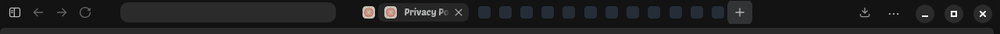

# Zen horizontal tabs

Zen Browser with the tabs on the **same row as the address bar** instead of the
vertical sidebar. Tested on Zen 1.21.15b (Linux).



```
[sidebar][<][>][reload][home]  [ address ]  [chip][chip][ open tab ][chip] ... [_][□][X]
```

* one 36px toolbar row, everything on it
* a tab that is not the current one is a **38px favicon chip**
* hovering a chip opens a **120px preview** with the page title and an X
* the current tab is a **220px pill** with its title
* the address box is 280px, the address is centred, domain only
* window buttons, app menu, downloads all keep working

## Install

Quit Zen completely, then:

```bash
./install.sh
```

It writes exactly two files into the profile and backs up anything already
there:

| file | what it does |
|---|---|
| `chrome/userChrome.css` | the whole layout |
| `user.js` | the handful of prefs the layout needs |

Nothing else in the profile is touched - bookmarks, history, accounts,
extensions, `zen-themes.css` and the mods folder are left alone.
`./uninstall.sh` deletes the two files and Zen goes back to normal.

## Tuning

Every size lives in one place, the top of `chrome/userChrome.css`:

```css
:root {
  --ctab-row: 36px;      /* height of the whole toolbar row */
  --ctab-strip: 30px;    /* height of the tab strip inside it */
  --ctab-chip: 38px;     /* width of a tab that is not the current one */
  --ctab-peek: 120px;    /* width of a chip while the pointer is on it */
  --ctab-active: 220px;  /* width of the current tab */
  --ctab-tab-h: 26px;    /* height of a tab */
  --ctab-right: 158px;   /* space kept for app menu + window buttons */
  --ctab-url: 280px;     /* width of the address box */
}
```

Edit, save, restart Zen.

## The prefs, and the one trade-off

`user.js` forces these:

| pref | why |
|---|---|
| `zen.tabs.vertical=false` | horizontal strip |
| `toolkit.legacyUserProfileCustomizations.stylesheets=true` | let Zen read `userChrome.css` |
| `zen.urlbar.replace-newtab=true` | Ctrl+T floats the address box over the page |
| `browser.tabs.insertRelatedAfterCurrent=true` | a link opens next to the page it came from |
| `browser.tabs.insertAfterCurrent=false` | Ctrl+T goes to the end of the strip |
| `zen.view.show-newtab-button-top=false` | new tabs at the end, not before the pinned ones |
| `toolkit.cosmeticAnimations.enabled=true` | tabs slide open and closed |

**The trade-off:** Zen ties the floating Ctrl+T box and the startup screen to
the *same* pref (`ZenSpaceManager.selectStartPage`). With
`zen.urlbar.replace-newtab=true` you get the floating box on Ctrl+T but Zen
starts on its blank tab; with `false` you start on the New Tab page but Ctrl+T
opens that page in a tab. There is no third setting - `browser.startup.page`,
`browser.startup.homepage=about:newtab` and `zen.urlbar.open-on-startup` were
all tested and none of them changes it. Two alternatives sit commented out at
the top of `user.js`.

## Does a Zen update wipe this?

No. Both files live in the **profile** (`~/.zen/<profile>/`), and updates
replace the application in `/opt/zen`, not the profile. What an update *can*
do is rename an internal element or class, and then a piece of the layout stops
matching - that is a CSS tweak, not a reinstall. This repo is the backup: after
any update, if something looks off, compare with `chrome/userChrome.css` here.
